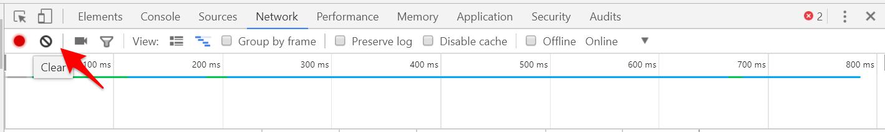
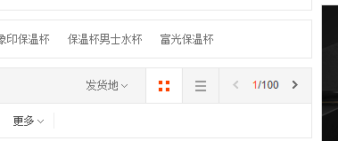
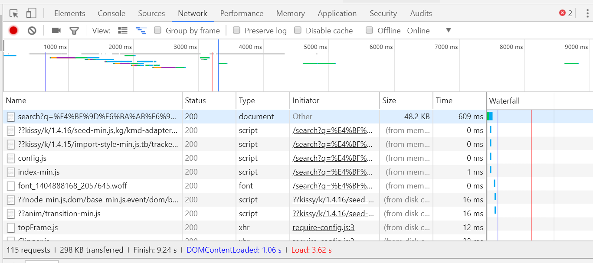
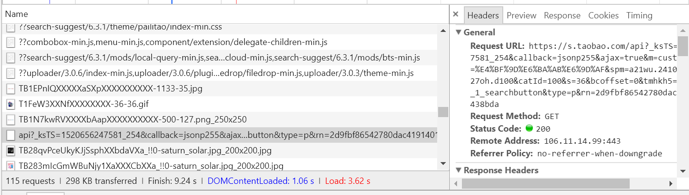
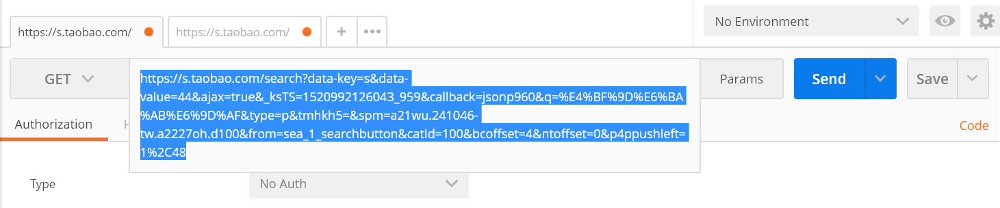

# README
|Item       |content
|-----------|---
|Title      |webCrawlerForTaobao
|Description|進階軟體專案開發(107下學期修習)作業, 以python撰寫網路爬蟲程式, 爬取掏寶網資料.
|Author    |Sopper
|E-mail    |sopper08@gmail.com
|Edit Time |2018/3/12

## HOWTODO  
### STEP 1
到掏寶網先查詢保溫杯.  

### STEP 2  
按F12 -> Network -> 先clear.  

### STEP 3  
進行網頁重整(F5).  

### STEP 4  
從Requests資料中找可以拿來爬蟲的資料.  

### STEP 5  
找到好爬蟲的資料後, 點擊右邊的Headers, 紀錄Request URL & Request Method.  

### STEP 6
到Postman以Request URL & Request Method檢查得到的資料是否正確, 並確定資料格式.

### STEP 7
未完成  
## 參考資料  
1. 大數學堂: http://www.largitdata.com/course_list/1  
2. 以python來解碼Json格式: http://www.runoob.com/python/python-json.html  
3. python-簡易爬蟲筆記: https://bonze.tw/python-%E7%B0%A1%E6%98%93%E7%88%AC%E8%9F%B2%E7%AD%86%E8%A8%98/  
4. [爬蟲實戰] 如何抓取591租屋網的資訊?: https://www.youtube.com/watch?v=zzMRbrOHlrk  
5. [爬蟲實戰] 如何突破蝦皮拍賣的重重限制以順利抓取拍賣商品資訊: https://www.youtube.com/watch?v=jV6eHoLzD2E&feature=youtu.be  